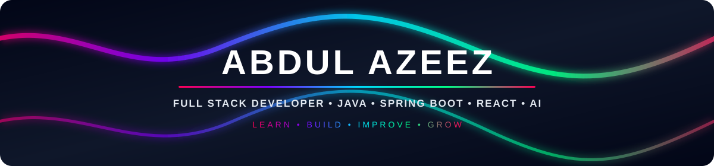

 

  

 

<!-- ======================== NAVIGATION ======================== -->

<table>
<tr>

<td align="center" width="80">

</td>

<td align="center" width="80">

</td>

<td align="center" width="80">

</td>

<td align="center" width="80">

</td>

<td align="center" width="80">

</td>

<td align="center" width="80">

</td>

</tr>
</table>

GitHub&nbsp;&nbsp;•&nbsp;&nbsp;
LinkedIn&nbsp;&nbsp;•&nbsp;&nbsp;
Email&nbsp;&nbsp;•&nbsp;&nbsp;
Instagram&nbsp;&nbsp;•&nbsp;&nbsp;
LeetCode&nbsp;&nbsp;•&nbsp;&nbsp;
Portfolio

 

<table>
<tr>

<td width="50%" valign="top">

<h3>👨‍💻 Who I Am</h3>

I'm <b>Abdul Azeez</b>, a passionate <b>Full Stack Developer</b>
from India who enjoys turning ideas into useful, real-world software.

My primary focus is <b>Java Full Stack Development</b>, combining
backend engineering with modern frontend development to build
clean and practical applications.

I'm also exploring <b>AI-powered applications</b> and experimenting
with ways to bring intelligent features into real-world software.

I believe the best way to learn technology is to
<b>build, break, understand and improve.</b>

</td>

<td width="50%" valign="top">

<h3 align="center">🎯 What I Work With</h3>

<table align="center" cellspacing="0" cellpadding="8">

<tr>
<td align="center" valign="middle" width="50">
☕
</td>
<td valign="middle">
<b>Backend Development</b> 
Java • Spring Boot • REST APIs
</td>
</tr>

<tr>
<td align="center" valign="middle" width="50">
⚛️
</td>
<td valign="middle">
<b>Frontend Development</b> 
React • Angular • HTML • CSS • JavaScript
</td>
</tr>

<tr>
<td align="center" valign="middle" width="50">
🗄️
</td>
<td valign="middle">
<b>Database Development</b> 
MySQL • PostgreSQL • Oracle
</td>
</tr>

<tr>
<td align="center" valign="middle" width="50">
🤖
</td>
<td valign="middle">
<b>AI Applications</b> 
AI APIs • Intelligent application features
</td>
</tr>

<tr>
<td align="center" valign="middle" width="50">
🐳
</td>
<td valign="middle">
<b>Development &amp; Deployment</b> 
Git • Docker • Linux • AWS
</td>
</tr>

</table>

</td>

</tr>
</table>

 

<table>
<tr>

<td align="center" width="180">

<h2>☕</h2>

<b>Java</b>

  

Core Java 
OOP • Collections • APIs

</td>

<td align="center" width="180">

<h2>🌱</h2>

<b>Spring Boot</b>

  

REST APIs 
Backend Architecture

</td>

<td align="center" width="180">

<h2>⚛️</h2>

<b>React</b>

  

Modern UI 
Component Development

</td>

<td align="center" width="180">

<h2></h2>

<b>AI Applications</b>

  

AI APIs 
Intelligent Features

</td>

<td align="center" width="180">

<h2>🐳</h2>

<b>DevOps</b>

  

Docker 
Linux • AWS

</td>

</tr>
</table>

 

 

<i>Projects where ideas become working software.</i>

 

<table align="center">
<tr>

<td width="50%" align="center" valign="top">

<h2>🤖</h2>

<h3>Nexus AI Chatbot</h3>

AI-powered conversational application focused on an interactive
chatbot experience.

<code>AI</code>
<code>API</code>
<code>Web</code>

</td>

<td width="50%" align="center" valign="top">

<h2>🛒</h2>

<h3>Cartify Web Application</h3>

Full-stack e-commerce application designed around realistic
shopping workflows.

<code>Full Stack</code>
<code>E-Commerce</code>
<code>Web</code>

</td>

</tr>
</table>

 

 

Explore all repositories

 

 

☕ Languages

  

🌐 Frontend

  

🌱 Backend

  

🗄️ Databases

  
  

  

🛠️ Tools & DevOps

  

☁️ Cloud

 

<table>
<tr>

<td align="center" width="170">

  

<b>Java Full Stack</b>

</td>

<td align="center" width="170">

  

<b>Spring Boot</b>

</td>

<td align="center" width="170">

  

<b>React</b>

</td>

<td align="center" width="170">

  

<b>Docker</b>

</td>

<td align="center" width="170">

  

<b>AI Applications</b>

</td>

</tr>
</table>

 

<a href="https://github.com/azeezazeez/Portfolio/blob/main/Portfolio/public/AZEEZ_RESUME.pdf">

 

<b>View My Resume</b>

</a>

 

<table>
<tr>

<td align="center" width="90">

</td>

<td align="center" width="90">

</td>

<td align="center" width="90">

</td>

<td align="center" width="90">

</td>

<td align="center" width="90">

</td>

<td align="center" width="90">

</td>

</tr>
</table>

 

<b>Open to opportunities, collaboration and interesting projects.</b>

 

<i>Thanks for stopping by.</i>

